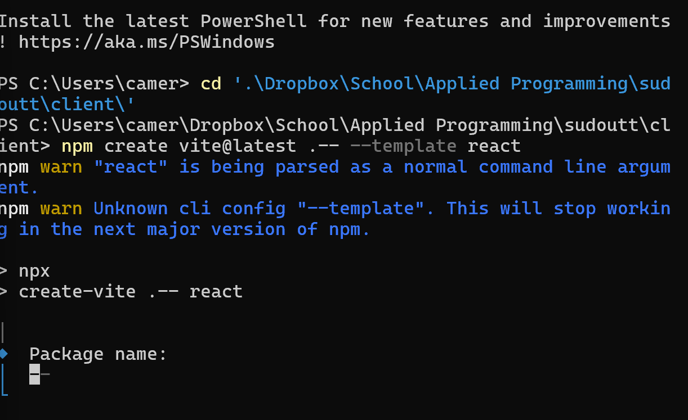
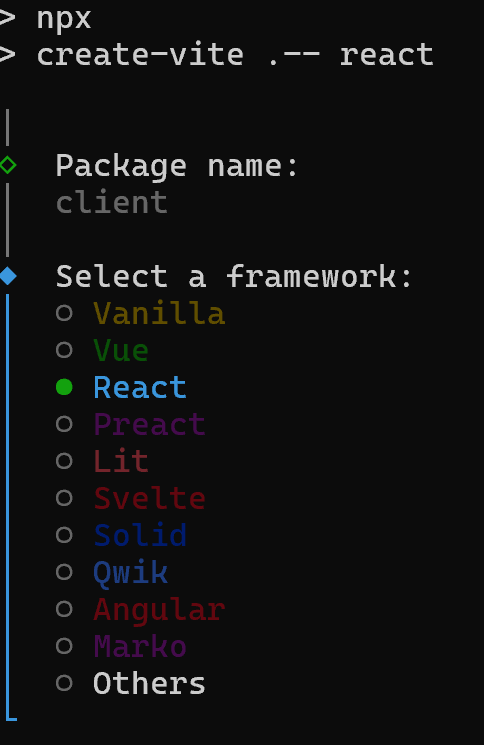

# Progress Log – Sudoku + Ultimate Tic‑Tac‑Toe Web App

This document tracks the setup progress, installations, decisions, and roadblocks encountered while starting the Sudoku + Ultimate Tic‑Tac‑Toe mashup web application for the Applied Programming sprint.

---

## Project Overview

**Goal:** Build a two‑player web‑based game that combines Sudoku constraints with Ultimate Tic‑Tac‑Toe mechanics.

**Tech Stack Chosen:**
- **Backend:** Node.js + Express
- **Frontend:** React (via Vite)
- **Validation Library (Stretch):** Zod
- **Dev Tools:** nodemon, npm

This stack was chosen because Node + React were already used successfully in a previous networking module, making integration smoother.

---

## Backend Setup (Node + Express)

### Step 1: Initialize Backend Project

Inside the `server/` directory:

```bash
npm init -y
```

This created a `package.json` file to manage backend dependencies and scripts.

---

### Step 2: Install Backend Dependencies

```bash
npm install express cors zod
```

**What each package does:**
- **express:** Web server framework to handle routes and HTTP requests
- **cors:** Allows the React frontend (running on a different port) to talk to the backend
- **zod:** JavaScript validation library used as the sprint stretch challenge

**Terminal output explanation:**
- `added 68 packages` → dependencies of dependencies were installed automatically
- `found 0 vulnerabilities` → no security issues detected
- `packages looking for funding` → optional open‑source notices, no action needed

---

### Step 3: Install nodemon (Dev Tool)

```bash
npm install -D nodemon
```

**Why:**
- Automatically restarts the backend server when files change
- Saves time during development
- Installed as a dev dependency because it is not needed in production

---

### Step 4: Create Backend Entry File

A key realization was that **Node does not create an entry file automatically**.

Manually created:
```
server/index.js
```

This file serves as the backend entry point (similar to `main()` in other languages).

---

### Roadblock #1: ES Module Error

**Error Encountered:**
```
SyntaxError: Cannot use import statement outside a module
```

**Cause:**
- React code (`import { useEffect } from 'react'`) was accidentally placed in `server/index.js`
- Node treats backend files as CommonJS modules by default

**Fix:**
- Removed all React code from `server/index.js`
- Used `require()` syntax for backend files
- Ensured React code only exists in `client/src/`

---

### Step 5: Verify Backend Is Running

A test route was added:

```js
app.get('/health', (req, res) => {
  res.json({ ok: true });
});
```

Verified by visiting:
```
http://localhost:3001/health
```

Successful response:
```json
{"ok": true}
```

---

## Frontend Setup (React + Vite)

### Step 6: Navigate to Client Directory

```bash
cd client
```

---

### Step 7: Create React App Using Vite

```bash
npx create-vite . -- react
```

**Key Notes:**
- `.` installs the project in the current folder (no nested directories)
- `react` specifies the framework

---

### Roadblock #2: npm Argument Warnings

**Warnings Seen:**
- `react is being parsed as a normal command line argument`
- `Unknown cli config "--template"`

**Fix:**
- Switched from `npm create vite@latest` to `npx create-vite`
- Followed the interactive prompts instead of passing flags

---

### Step 8: Vite Prompts

Selections made:
- **Package name:** `client`
- **Framework:** React
- **Variant:** JavaScript

These choices kept the setup simple and aligned with backend code examples.

---

### Step 9: Install Frontend Dependencies

```bash
npm install
```

This downloaded all React and Vite dependencies defined in `client/package.json`.

---

### Step 10: Run React Dev Server

```bash
npm run dev
```

Result:
- Vite dev server started
- React app available at:

```
http://localhost:5173
```

The default Vite + React starter page confirmed the frontend was working.

---

## Images / Screenshots From Setup

> Place the following images in the same directory as this markdown file or an `images/` folder and update paths if needed.

### Image 1 – Vite Asking for Package Name



### Image 2 – React Framework Selection Screen



---

## Current Status

✅ Backend server running on port **3001**  
✅ Frontend React app running on port **5173**  
✅ Backend health endpoint confirmed  
✅ Vite + React setup successful  

The project is now ready to:
- Connect React to the backend via `fetch()`
- Render the game board UI
- Implement game rules, validation, and scoring

---

## Next Planned Steps

1. Clean up default Vite starter files
2. Fetch backend game state from React
3. Render 9×9 board UI
4. Add move input + validation feedback
5. Implement forced‑board logic visualization

---

**End of progress log.**

